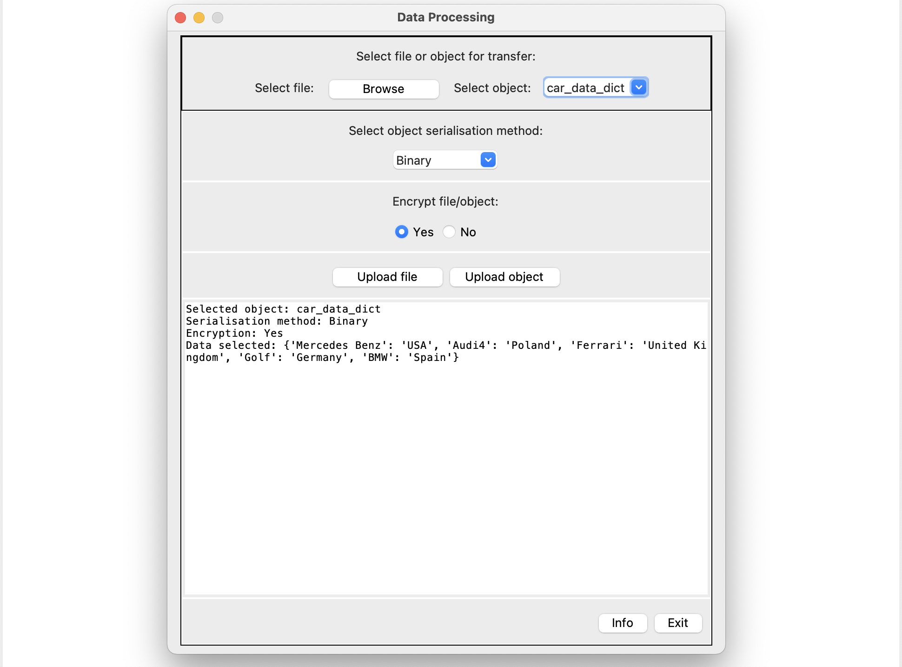
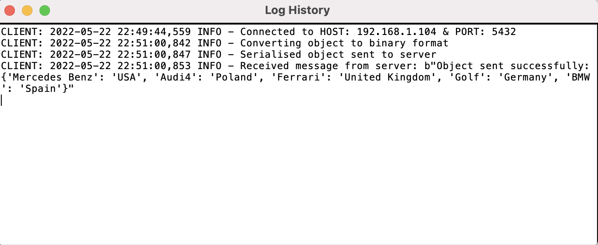

# Group Project - Client/Server Network Application
Library for communicating messages between a client server network

## Cloning the repository

```shell
git clone -c https://gitlab.csc.liv.ac.uk/sgalukow/client_server_network.git
```

## Installing dependencies

```shell
pip install -r requirements.txt
```

## Installing the repository
(After installing dependencies)

```shell
python setup.py install
```

## Running the application
Server is required to be running before client attempts to connect.
1. Run main-server.py (or custom server implementation)
2. Run main-client.py (or custom client implementation)

## Stopping the application
Clients is required to disconnect from server so the server can gracefully close client connection before the server is stopped.
1. Stop main-client.py
2. Stop main-server.py

## Examples

### Through code
#### server.py
```Python
import socket
from client_server_network.server import Server

SERVER_HOST = socket.gethostname()
SERVER_PORT = 5432

s = Server(SERVER_HOST, SERVER_PORT)
s.recvall()
```

#### client.py

```Python
from client_server_network.client import Client
from client_server_network.interface import UserInterface
import socket

SERVER_HOST = socket.gethostname()
SERVER_PORT = 5432

c = Client(SERVER_HOST, SERVER_PORT)
c.connection()
```


### Through config

#### server.py
```Python
import socket
import configparser
from client_server_network.server import Server

config = configparser.ConfigParser()
config.read("config.cfg")
host = config['LocalServer']['host']
SERVER_HOST = socket.gethostname() if host.lower() == "localhost" else host
SERVER_PORT = config['LocalServer'].getint('port')

s = Server(SERVER_HOST, SERVER_PORT)
s.recvall()
```

#### client.py
```Python
from client_server_network.interface import UserInterface

ui = UserInterface()
ui.run(config="Config.cfg")
```

### Through GUI (Tkinter)

#### server.py
```Python
from client_server_network.client import Client
from client_server_network.interface import UserInterface
import socket

SERVER_HOST = socket.gethostname()
SERVER_PORT = 5432

c = Client(SERVER_HOST, SERVER_PORT)
c.connection()
```

#### client.py
```Python
from client_server_network.interface import UserInterface
import socket

SERVER_HOST = socket.gethostname()
SERVER_PORT = 5432

ui = UserInterface(SERVER_HOST, SERVER_PORT)
ui.run()
```


### GUI


### Client Log


### Server Log
